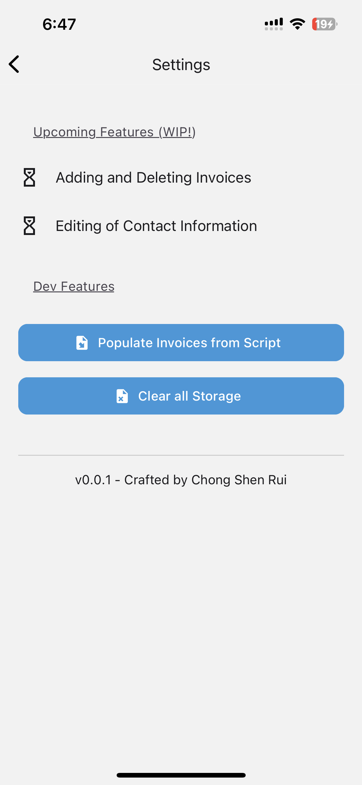

# Invoices - V1! 🍪🧃

Custom-built solution as my family needed an application that allows for:

- Different invoice lists for different suppliers
- Functionality to customise quantity of products and have price calculated automatically
- Declaring of initial invoices and contact details through a script (to be phased out with `V2 - improved CRUD functionality`)
- Automatic parsing of invoice list as a message to send to supplier through Whatsapp
- Larger-than-usual font sizes for improved readability and usage

| Main Screen                                                  | Invoice Screen (modifying item details)                                  | Invoice Screen (Whatsapp message preview)                                 | Whatsapp Message                                    | Settings Screen Sample                                            |
| ------------------------------------------------------------ | --------------------------------------------------------------------------- | ---------------------------------------------------------------------------- | --------------------------------------------------- | ----------------------------------------------------------------- |
|  |  |  |  |  |

Future work includes:

- Support for more CRUD operations on invoices and contacts - using WatermelonDB instead of AsyncStorage

## Libraries Used

For customised components and icons:

- `react-native-paper`
- `react-native-dropdown-picker`

For persistent storage:

- `react-native-async-storage/async-storage`
  - Only used for quicker initial development and psuedo-static data
  - In the midst of exploring WatermelonDB usage for more streamlined CRUD operations in V2
